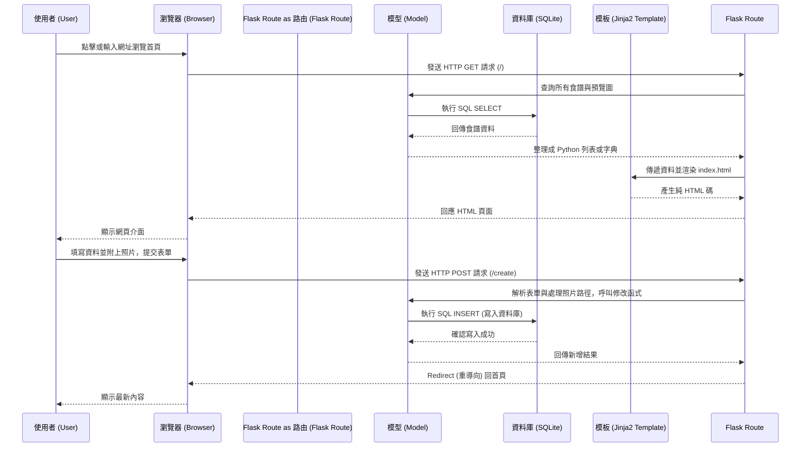

# 系統架構文件 - 智慧食譜管理系統

這份文件基於產品需求文件 (PRD) ，規劃與說明「智慧食譜管理系統」的整體技術架構與資料夾結構。

## 1. 技術架構說明

本專案採用經典的伺服器渲染 (Server-Side Rendering) 架構，不區分前後端分離，藉此加速初期開發並降低複雜度。

### 選用技術與原因
- **後端框架：Python + Flask**
  - **原因**：Flask 是輕量級、易於上手的微框架，十分適合開發這類功能單純但五臟俱全的食譜系統。
- **模板引擎：Jinja2**
  - **原因**：Flask 內建支援 Jinja2，能直接在 HTML 裡面崁入 Python 邏輯（如迴圈列印食譜步驟、條件判斷），快速完成頁面渲染。
- **資料庫：SQLite**
  - **原因**：SQLite 是一套無伺服器 (serverless) 的輕量級資料庫，所有的資料儲存在單一檔案中，無需額外安裝或設定資料庫引擎，非常適合處理食譜管理與步驟這類結構化的資料。

### Flask MVC 模式說明
專案將依循類似 MVC (Model-View-Controller) 的設計模式：
- **Model (模型)**：負責定義資料庫的結構，以及如何跟 SQLite 資料庫互動（儲存或讀取食譜、食材與步驟資料）。
- **View (視圖)**：Jinja2 模板與 CSS 樣式，負責將 Controller 取回的資料組裝成 HTML 頁面，呈現給使用者。
- **Controller (控制器/路由)**：Flask 的 `routes` 負責接收瀏覽器傳來的請求（如點擊分類、新增食譜），呼叫對應的 Model 修改資料，最後把結果交給 View (Jinja2) 去渲染成網頁。

## 2. 專案資料夾結構

以下為系統資料夾與檔案結構，遵循職責分離原則以便未來擴充維護：

```text
web_app_development/
├── app/
│   ├── models/            ← 資料庫模型的定義目錄
│   │   ├── __init__.py
│   │   └── recipe.py      ← 食譜、食材清單、步驟的儲存邏輯
│   ├── routes/            ← 負責處理網址路由的目錄（Controller）
│   │   ├── __init__.py
│   │   ├── index.py       ← 首頁與食譜列表路由
│   │   └── recipe.py      ← 新增、查看、編輯食譜的專屬路由
│   ├── templates/         ← Jinja2 HTML 頁面模版（View）
│   │   ├── base.html      ← 網站共用主版面 (包含 NavBar 等)
│   │   ├── index.html     ← 首頁（食譜網格、分類過濾）
│   │   ├── detail.html    ← 食譜詳細頁（食材與步驟）
│   │   └── create.html    ← 新增食譜的表單頁面
│   └── static/            ← 網站的靜態資源
│       ├── css/
│       │   └── style.css  ← 網站共用主要樣式與佈局
│       ├── js/            ← 必要的互動腳本
│       └── uploads/       ← 使用者上傳的食譜首圖與步驟圖
├── instance/              ← 存放敏感資訊或本地狀態的資料夾（不會進入 Git 版本控制）
│   └── database.db        ← SQLite 資料庫本體檔案
├── docs/                  ← 專案技術與需求設計文件
│   ├── PRD.md             ← 產品需求文件
│   └── ARCHITECTURE.md    ← 本系統架構文件
├── app.py                 ← 程式執行入口與 Flask 初始化設定
└── requirements.txt       ← Python 相依套件清單
```

## 3. 元件關係圖

透過以下的流程圖可以了解使用者、瀏覽器、Flask 與資料庫的互動方式：



## 4. 關鍵設計決策

1. **目錄結構分離以提高可維護性**
   採用 `routes/`、`models/` 與 `templates/` 分離的設計。這能確保路由處理邏輯不會跟資料庫操作混淆在一起，未來擴充功能時能更容易管理。
 
2. **圖片一律存在本地端專屬目錄資料夾 (`static/uploads/`)**
   食譜預覽圖與每個步驟可能具備的圖片都會先存進本地端，並在資料庫內僅記錄「檔案路徑」。這能避免資料庫因存放二進位檔案過於肥大、讀取變慢。

3. **統一不使用前後端分離 (Single App 模式)**
   系統主要操作在於內容的 CRUD（新增、讀取、修改、刪除），對即時非同步更新的要求較低。採用 Flask + Jinja2 結合傳統表單提交來處理，可以省去大量前端 API 調用的處理時間。

4. **主從資料表設計**
   因應「分開材料清單」和「分步驟引導」，我們在後續資料庫設計上會將食譜(Recipe)與食材(Ingredient)、步驟(Step)分離成獨立的資料表以 1-to-N 關聯起來，確保資料結構清晰且好增加與調整。
