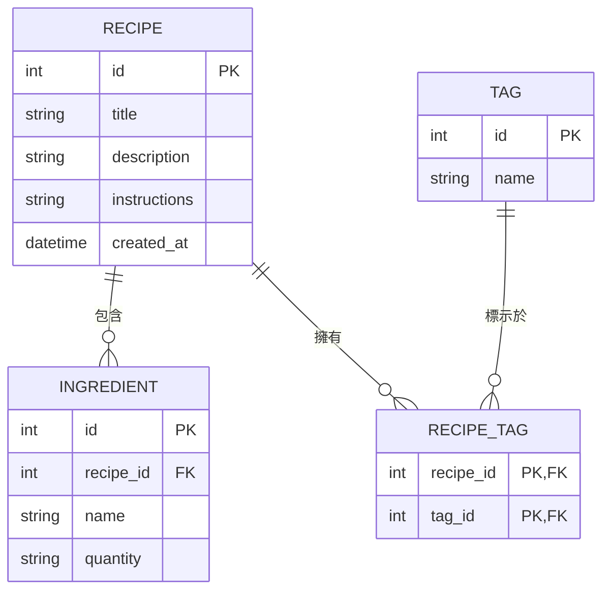

# 資料庫設計文件 (DB Design)

這份文件描述了食譜管理系統的資料表結構與關聯，並針對 SQLite 提供了完整的 Schema 定義。

## 1. ER 圖（實體關係圖）

本系統實體包含：食譜 (Recipe)、食材 (Ingredient)、標籤 (Tag)。
- 一篇食譜可以有多個食材 (一對多)
- 一篇食譜可以有多個標籤，一個標籤可以標示多篇食譜 (多對多，透過 RecipeTag 關聯)

## 2. 資料表詳細說明

### 2.1 `recipes` (食譜表)
核心資料表，儲存食譜的主要資訊。
- `id` (INTEGER): Primary Key，自動遞增。
- `title` (TEXT): 食譜名稱 (必填)。
- `description` (TEXT): 食譜簡介或簡短描述。
- `instructions` (TEXT): 完整烹飪步驟說明。
- `created_at` (DATETIME): 建立時間，預設為當下時間。

### 2.2 `ingredients` (食材表)
紀錄某個食譜所需準備的所有食材及份量。
- `id` (INTEGER): Primary Key，自動遞增。
- `recipe_id` (INTEGER): Foreign Key，對應到 `recipes.id` (必填)。
- `name` (TEXT): 食材名稱，例如「去骨雞腿肉」(必填)。
- `quantity` (TEXT): 食材份量，例如「300g」或「兩大匙」。

### 2.3 `tags` (標籤表)
用來將食譜分類用的標籤，例如「全素」、「低卡」、「前菜」。
- `id` (INTEGER): Primary Key，自動遞增。
- `name` (TEXT): 標籤名稱 (必填且唯一)。

### 2.4 `recipe_tags` (食譜與標籤關聯表)
處理食譜與標籤之間的多對多關係。
- `recipe_id` (INTEGER): Foreign Key，對應到 `recipes.id`。
- `tag_id` (INTEGER): Foreign Key，對應到 `tags.id`。
- *(兩者組成複合 Primary Key)*
