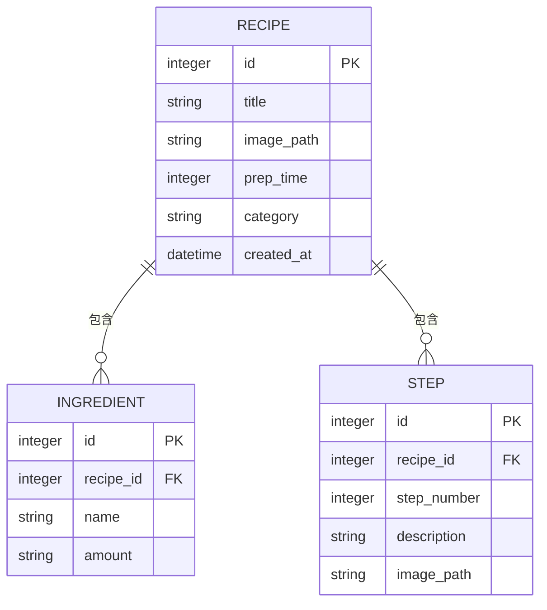

# 資料庫設計文件 - 智慧食譜管理系統

本文件基於 PRD 與 FLOWCHART 產出，定義了系統後端 SQLite 資料庫的各項表結構設計與關聯。

## 1. ER 圖 (實體關係圖)

## 2. 資料表詳細說明

### RECIPE (食譜主表)
儲存食譜的基本通用資訊。
- `id` (INTEGER): 主鍵，自動遞增。
- `title` (TEXT): 食譜名稱（必填）。
- `image_path` (TEXT): 食譜預覽圖的路徑（非必填）。
- `prep_time` (INTEGER): 預估烹飪時間，單位通常為分鐘（必填）。
- `category` (TEXT): 食譜分類標籤，如中式、西式或甜點（必填）。
- `created_at` (DATETIME): 建立時間，預設為當下時間。

### INGREDIENT (食材清單表)
儲存特定食譜需要的每一項食材。
- `id` (INTEGER): 主鍵，自動遞增。
- `recipe_id` (INTEGER): 外鍵，關聯至 RECIPE 的 id。
- `name` (TEXT): 食材名稱，如「豬肉」（必填）。
- `amount` (TEXT): 份量與單位，如「250g」或「一大匙」（必填）。

### STEP (烹飪步驟表)
儲存特定食譜的教學順序與各步驟內容。
- `id` (INTEGER): 主鍵，自動遞增。
- `recipe_id` (INTEGER): 外鍵，關聯至 RECIPE 的 id。
- `step_number` (INTEGER): 步驟順序位數，如 1, 2, 3（必填）。
- `description` (TEXT): 做法文字說明（必填）。
- `image_path` (TEXT): 單一步驟的對應圖片路徑（非必填）。
