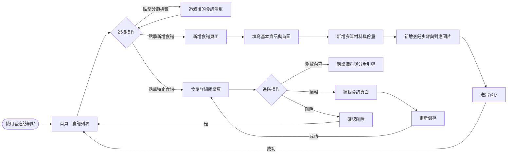
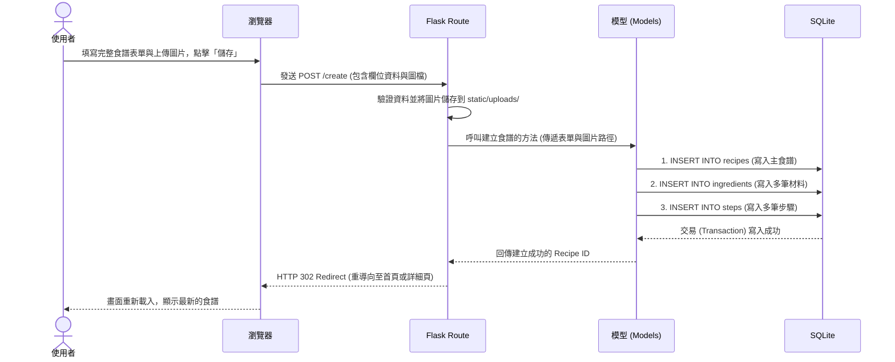

# 流程圖文件 - 智慧食譜管理系統

本文件根據產品需求文件 (PRD) 與系統架構文件 (ARCHITECTURE)，將系統的使用者操作路徑以及資料處理流程視覺化。

## 1. 使用者流程圖（User Flow）

此流程圖呈現從使用者進入網站開始，瀏覽食譜、新增食譜，到編輯與刪除等主要功能的操作路徑。

## 2. 系統序列圖（Sequence Diagram）

以下流程描述「使用者點擊新增食譜」直到「資料存入資料庫」的底層系統互動過程。

## 3. 功能清單對照表

根據上述流程，初步定義出食譜管理系統需要的 URL 路由與 HTTP 方法對照：

| 功能名稱 | 對應 URL 路徑 | HTTP 方法 | 說明 |
| :--- | :--- | :--- | :--- |
| **查看首頁** | `/` | GET | 顯示所有食譜卡片縮圖 |
| **依分類篩選** | `/?category=xxx` 或 `/category/<name>` | GET | 以分類標籤過濾食譜清單 |
| **顯示新增表單** | `/create` | GET | 載入用來填寫新食譜的網頁介面 |
| **送出新增食譜** | `/create` | POST | 接收表單並儲存至資料庫 |
| **查看食譜詳細** | `/recipe/<id>` | GET | 列出該篇食譜的所有食材與分步引導 |
| **顯示編輯表單** | `/recipe/<id>/edit` | GET | 載入並帶入舊資料以供編輯 |
| **送出編輯食譜** | `/recipe/<id>/edit` | POST | 更新該篇食譜資料庫的內容 |
| **刪除特定食譜** | `/recipe/<id>/delete` | POST | 執行刪除作業並回到首頁 |
